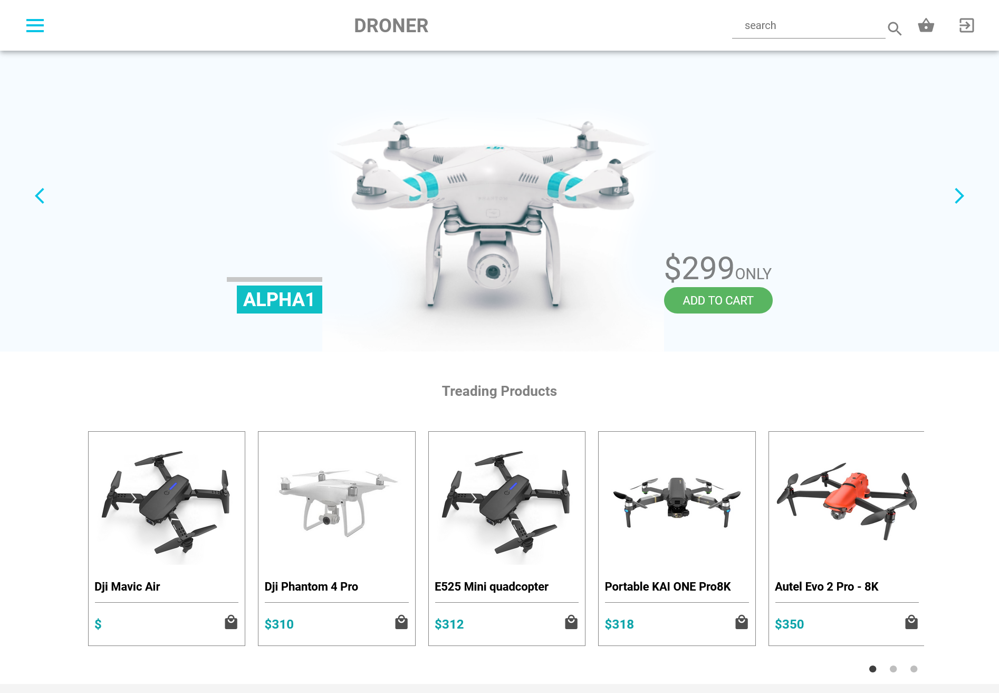

## Droner Shopping & Landing Page using react js

## Demo

[Droner](https://milad-drone.netlify.app/)

## Features

- Authentication
- Slider
- Add To Cart
- Remove From Cart
- Increment and Decrement 
- Rest API

## Description

Droner Shopping & Landing Page is a demo webpage for droner company. Users could view the company's product lineup and find out information about the business on the website. The user needs to be authenticated in order to add the item to their cart, and firebase handles authentication. In order to handle adding, removing, incrementing, and decrementing products from the cart and fetch data from a restfull api, Redux Toolkit is implemented. The Node JS and Express JS-based restful api is hosted by railway and was built for that purpose. Style-components are used exclusively to create the website's style.

## Technologies
- [React JS](https://reactjs.org/docs/getting-started.html)
- [Style-Components](https://styled-components.com/)
- [MUI](https://mui.com/)
- [FireBase](https://firebase.google.com/?hl=id)
- [Redux Toolkit](https://redux-toolkit.js.org/)
